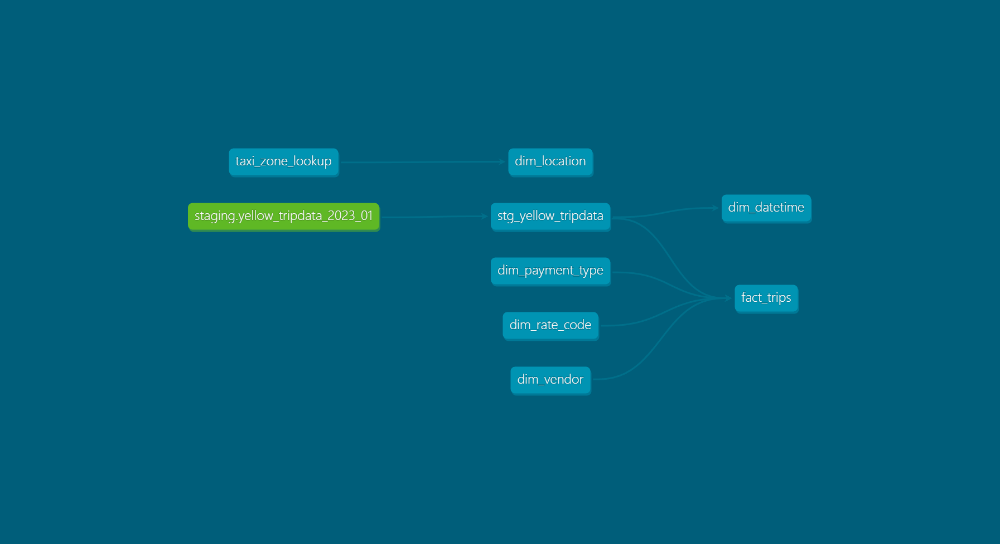
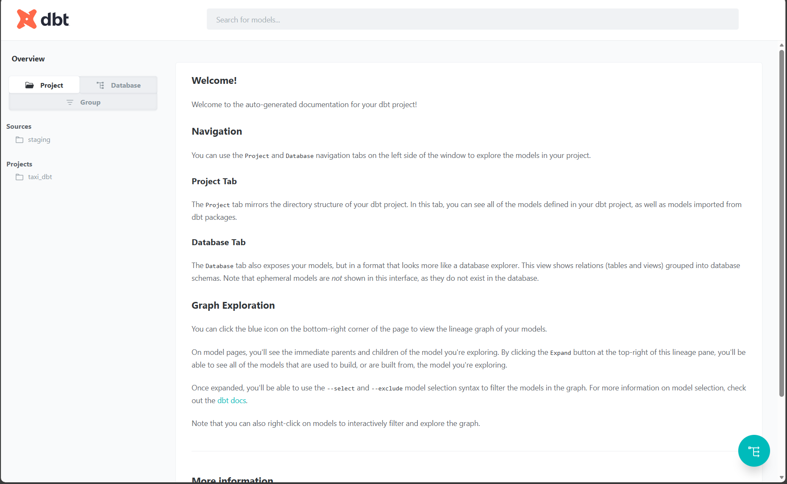
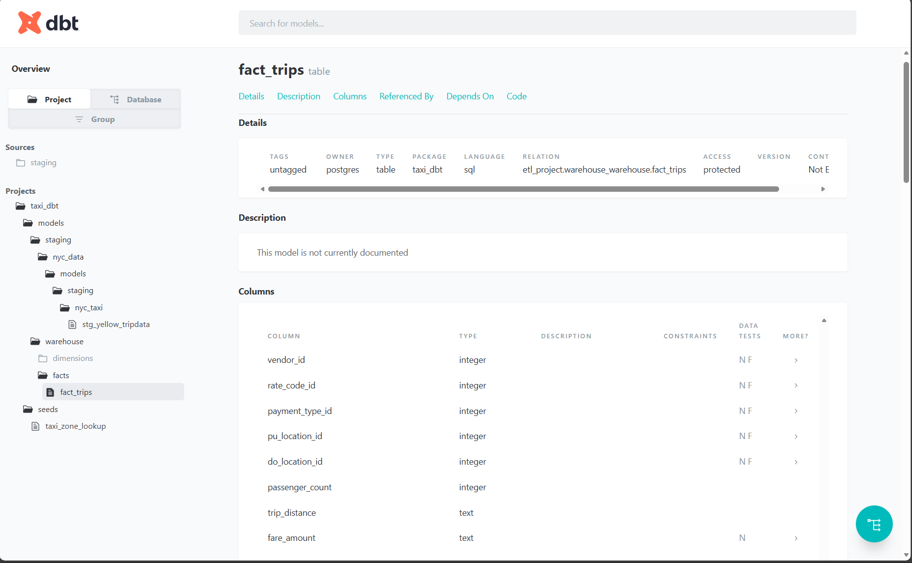

# Data Warehouse & ETL Pipeline (NYC Taxi Data)


A complete end-to-end data engineering project using **dbt**, **PostgreSQL**, **Docker**, and **Airflow**.  
The project builds a **modern analytics warehouse** and applies **ELT transformations** using the **NYC Yellow Taxi dataset (Jan 2023)**.

---

## Architecture Overview

1. Raw taxi data is loaded into PostgreSQL.
2. dbt creates:
   - Staging models
   - Dimension tables
   - A large fact table (`fact_trips`)
3. dbt tests validate data quality and integrity.
4. dbt Docs provides interactive documentation and DAG lineage.
5. Airflow (optional) is used for future orchestration.

---

## Tech Stack

| Layer | Technologies |
|-------|-------------|
| Orchestration | Apache Airflow |
| Data Warehouse | PostgreSQL |
| Transformations | dbt Core |
| Ingestion | Python (pandas, SQLAlchemy) |
| Containerization | Docker & Docker Compose |
| Documentation | dbt Docs |
| Dataset | NYC Yellow Taxi 2023 |

---

## Folder Structure
```txt
009-DataWarehouse + ETL/
│
├── airflow_docker/
│
├── data_raw/
│
├── logs/
│
├── pics/
│   ├── dbt-dag.png
│   ├── Fact_trips.png
│   └── MainPage.png
│
├── scripts/
│   └── ingest_taxi_to_postgres.py
│
├── seeds/
│   └── taxi_zone_lookup.csv
│
├── taxi_dbt/
│   ├── models/
│   │   ├── staging/
│   │   └── warehouse/
│   │       ├── dimensions/
│   │       └── facts/
│   ├── dbt_project.yml
│   └── profiles.yml  (local)
│
└── venv/

```

---

## Pipeline Steps

### **1. Ingestion (Python → Postgres)**  
Loads raw parquet → DataFrame → PostgreSQL.


python scripts/ingest_taxi_to_postgres.py


Creates:


staging.yellow_tripdata_2023_01


---

### **2. dbt Staging Layer**

- Standardizes column names  
- Fixes datatypes  
- Prepares data for modeling  
- Avoids null mismatches for FK relationships  

Model example: `stg_yellow_tripdata.sql`.

---

### **3. dbt Warehouse Models**

#### **Dimension Tables**
- `dim_vendor`
- `dim_rate_code`
- `dim_payment_type`
- `dim_location`
- `dim_datetime`

#### **Fact Table**
`fact_trips` (3M+ rows)
- Fully joined with all dimensions
- Stores trip metrics (fare, tips, surcharge, distance, etc.)
- Handles missing IDs via `COALESCE`

---

##  Data Quality Tests

Located in:  


taxi_dbt/models/warehouse/schema.yml


### **Dimension Tests**
- `not_null`
- `unique`

### **Fact Table Tests**
- FK relationship tests  
- `not_null` on critical numeric fields  
- `not_null` on timestamps

Run:


dbt test


All tests passed.

---

## dbt Documentation

Generate:


dbt docs generate


Serve locally:


dbt docs serve


Includes:
- Model documentation  
- Column details  
- Lineage graph  
- Table relationships  

---

## Screenshots

### **dbt DAG Lineage**


### **dbt Main Documentation Page**


### **Fact Table Documentation**


---

##  How to Run Locally

### **1. Install Dependencies**


pip install -r requirements.txt


### **2. Activate Environment**


source venv/Scripts/activate # Windows


### **3. Start Airflow (Optional)**


docker-compose up -d


### **4. Run Ingestion**


python scripts/ingest_taxi_to_postgres.py


### **5. Run dbt Models**


cd taxi_dbt
dbt build


### **6. Generate Documentation**


dbt docs serve


---

## Future Enhancements

- Add incremental dbt models  
- Full Airflow DAG (ingestion + dbt run)  
- Add Kafka real-time ingestion  
- Query optimization + partitioning  
- BI dashboards (Tableau / Power BI)  
- CI/CD with GitHub Actions  

---
